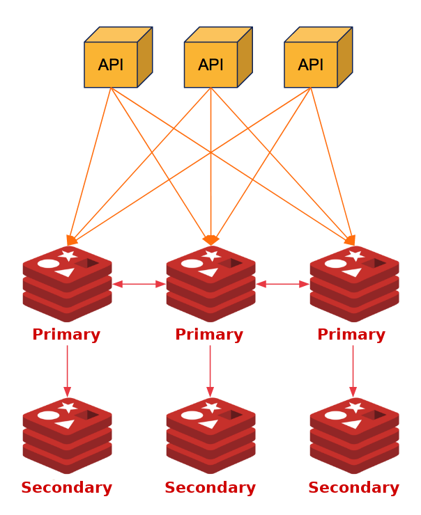
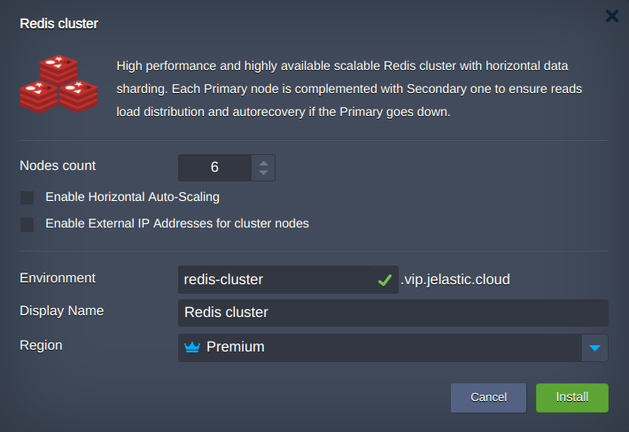
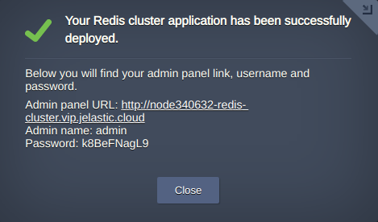

# Redis Cluster

A Redis cluster is often used as a tool for data storage, caching, message brokering, and other tasks. It became rich thanks to the ability to scale and high speed. With this solution you can provision a three-server cluster for data sharding, high availability and high performance due to replication to the Secondary nodes. If the Primary fails, the Secondary server automatically replaces it.

## Redis Cluster Topology

Default cluster topology looks as follows. 

 

  
Cluster can be scaled out/in either automatically or manually. Each scaling operation is performed by pair of nodes - one Primary and one Secondary.
&nbsp;   
&nbsp;  
## Redis Cluster Deployment to the Cloud

Get your Virtuozzo account at any of available [hosting provider](https://www.virtuozzo.com/application-platform-partners/).

Import the  [package manifest raw link](https://github.com/jelastic-jps/redis-cluster/blob/main/manifest.jps) or find Redis Cluster application in the [Marketplace](https://www.virtuozzo.com/application-platform-docs/marketplace/) within the [dashboard](https://www.virtuozzo.com/application-platform-docs/dashboard-guide).  

## Installation Process

In the opened confirmation window at Platform dashboard, if required change:  

* __Nodes count__ - minimal number is 6 (3 Primary and 3 Secondary nodes), then initial number of nodes can be increased by 2 (one Primary and one Secondary)

* __Enable Horizontal Auto-Scaling__ - cluster will be automaticaly scaled horizontaly depending on specified [scaling triggers](https://www.virtuozzo.com/application-platform-docs/automatic-horizontal-scaling/#triggers-for-automatic-scaling)

* __Enable External IP Addresses for cluster nodes__ - with this option cluster will be configured to work via public IPs only. Make sure that your quotas are enough to assing 6 public IP addresses at least for your cluster  

* __Environment__ name  

* __Display Name__  

* destination __[Region](https://www.virtuozzo.com/application-platform-docs/environment-regions)__ if several are available  

and click on __Install__.

 

Once the deployment is finished, you’ll see an appropriate success pop-up.

 

 The application is ready to use, just proceed to the cluster admin panel by respective URL and user credentials to do required configuration and customization.

 

